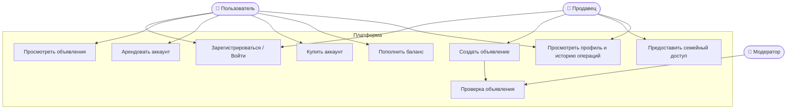
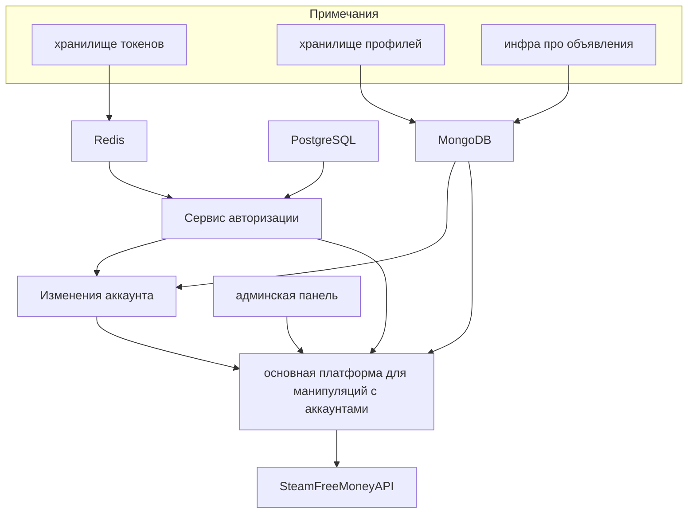
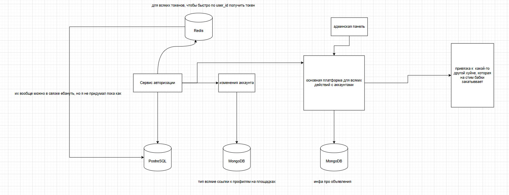

# Сдача курсовой работы, часть 1
### 1) Согласовать с преподавателем предметную область, для которой будет разрабатываться информационная система.
В качестве предметной области выбрана онлайн-платформа (биржа) для аренды и продажи аккаунтов Steam и других игровых сервисов.

Почему выбрали:

Так как на рынке существует большое количество игр, в которых большую часть времени занимает прокачка аккаунта (хороший пример - War Thunder, в котором новую аудиторию заманивают топовой техникой, которую игроку придется очень долго качать, если он хочет на ней играть), то некоторые люди не хотят из-за этого создавать свой аккаунт и делать все самим, а купить чужой, от того человека, которому уже надоела игра.

Еще существуют люди, которые в свое время купили много игр в стиме и не играют в них. Теперь смотрим на человека, который не хочет покупать игру за 1000р, но хочет в нее поиграть, на торренте нету нормального фикса, либо человек боится скачивать что-либо с торрента. В таком случае должна помочь наша система, человек без игр, за маленькую плату просится в семью Steam человека с играми и проходит ту игру, которую он хотел.

Наша система во всех случаях будет предоставлять безопасную двустороннюю сделку, (например) первый человек будет получать доступ в семейный просмотр игр, а второй деньги за предоставляемые услуги


### 2) Составить подробное текстовое описание предметной области.
Современная игровая индустрия предполагает наличие множества цифровых сервисов, таких как Steam, Epic Games Store и других. У пользователей накапливаются значительные игровые библиотеки и аккаунты, которые представляют ценность для обмена, временного использования (аренды) или продажи.

Существуют следующие типовые ситуации:

- Игрок хочет арендовать аккаунт для временного доступа к играм, не приобретая их навсегда.

- Пользователь может продать свой аккаунт или сдать его в аренду для монетизации.

- Пользователь может предоставить семейный доступ к своей библиотеке игр.

- Игрок может пополнить баланс своего игрового аккаунта через платформу.

Все объявления проходят проверку модератора для исключения мошенничества и соблюдения правил.

Таким образом, предметная область — это биржа цифровых аккаунтов и аренды игровых библиотек, где встречаются покупатели, продавцы и модераторы.


### 3) Сформулировать, зачем нужна информационная система для представленной предметной области, какие задачи она позволит решить.

Информационная система необходима для создания безопасной и удобной площадки, где пользователи могут обмениваться игровыми аккаунтами и услугами аренды.
- Система позволит безопасно производить сделки, не боясь, что тебя "разведут" при покупке аккаунта, когда ты заплатил деньги, а логин и пароль от купленного аккаунта тебе не прислали
- Будет обеспечен удобный интерфейс для проведения операций в системе.
- Будет поддержка проверки объявлений модератором для исключения мошеннических предложений.

### 4) Составить функциональные/нефункциональные требования к разрабатываемой информационной системе.

#### Функциональные требования

- Регистрация и авторизация пользователей.
- Возможность продавать и сдавать в аренду аккаунты.
- Возможность арендовать аккаунты.
- Возможность предоставлять семейный доступ.
- Возможность пополнять баланс игрового аккаунта.
- Возможность создавать объявления.
- Модерация объявлений.
- Ведение истории операций (покупка, аренда, пополнение).
- Уведомления пользователям о статусе сделок.

#### Нефункциональные требования
- Надежность: система должна обеспечивать защиту данных и сохранность сделок.
- Производительность: время отклика не должно превышать 3 секунд.
- Масштабируемость: поддержка увеличения числа пользователей без снижения производительности.
- Юзабилити: простой и понятный интерфейс.
- Доступность: работа 24/7, минимизация простоев.
- Безопасность: шифрование данных, защита от SQL-инъекций, защита от несанкционированного доступа.


### 5) Построить модели основных прецедентов (прецеденты согласуются с преподавателем), составить их описание.

#### Основные акторы:
- Пользователь — может арендовать аккаунт, купить аккаунт, получить семейный доступ, пополнить баланс.
- Продавец — может выставлять аккаунт на продажу или сдачу в аренду, предоставлять семейный доступ.
- Модератор — проверяет объявления.
#### Прецеденты:
- Зарегистрироваться / войти — общий для всех.
- Арендовать аккаунт — пользователь получает временный доступ.
- Купить аккаунт — пользователь получает аккаунт в собственность.
- Выставить аккаунт на продажу — продавец создает объявление.
- Сдать аккаунт в аренду — продавец предоставляет временный доступ.
- Предоставить семейный доступ — продавец открывает доступ к своей библиотеке игр.
- Пополнить баланс — пользователь пополняет свой игровой кошелек.
- Проверить объявление — модератор проверяет валидность и корректность данных. 
#### Пример описания прецедента: «Арендовать аккаунт»
```
Акторы: Пользователь, Продавец, Система.
Предусловие: Пользователь зарегистрирован и авторизован.

Основной сценарий:
Пользователь выбирает аккаунт из списка доступных для аренды.
Система показывает условия аренды (цена, срок).
Пользователь подтверждает аренду и оплачивает.
Система фиксирует сделку, списывает средства и открывает доступ пользователю.
Продавец получает уведомление о передаче доступа.
Постусловие: Пользователь получает временный доступ, продавец получает оплату.
Исключения: Недостаточно средств, аккаунт снят с аренды, ошибка модерации.
```




### 6) Предложить архитектуру будущей системы.

⬆ крч вот это вот надо заебашить на meramaid по хорошему
#### Примерный стек технологий:
- BackEnd: Spring + kotlin
- FrontEnd: React + TS
- DB: PostgreSQL + кубернатес / MongoDB / Redis
- docker


