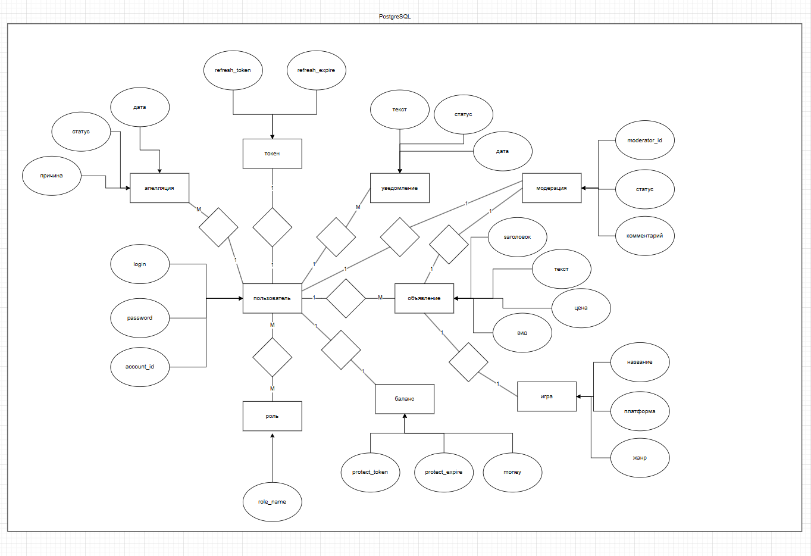
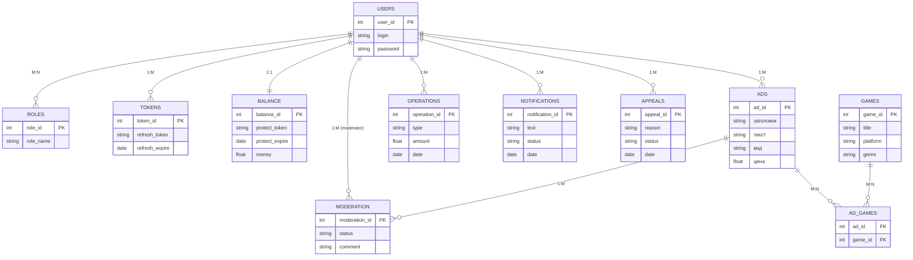

1) Сформировать ER-модель базы данных (на основе описаний предметной области и прецедентов из предыдущего этапа).

2) На основе ER-модели построить даталогическую модель.

```mermaid
erDiagram
    USERS {
        int user_id PK
        string login
        string password
    }

    ROLES {
        int role_id PK
        string role_name
    }

    TOKENS {
        int token_id PK
        string refresh_token
        date refresh_expire
    }

    BALANCE {
        int balance_id PK
        string protect_token
        date protect_expire
        float money
    }

    ADS {
        int ad_id PK
        string заголовок
        string текст
        string вид
        float цена
    }

    OPERATIONS {
        int operation_id PK
        string type
        float amount
        date date
    }

    MODERATION {
        int moderation_id PK
        string status
        string comment
    }

    NOTIFICATIONS {
        int notification_id PK
        string text
        string status
        date date
    }

    APPEALS {
        int appeal_id PK
        string reason
        string status
        date date
    }

    GAMES {
        int game_id PK
        string title
        string platform
        string genre
    }

    AD_GAMES {
        int ad_id FK
        int game_id FK
    }

    %% связи
    USERS ||--o{ TOKENS : "1:M"
    USERS ||--o{ ROLES : "M:N"
    USERS ||--o{ ADS : "1:M"
    USERS ||--|| BALANCE : "1:1"
    USERS ||--o{ OPERATIONS : "1:M"
    USERS ||--o{ NOTIFICATIONS : "1:M"
    USERS ||--o{ APPEALS : "1:M"
    USERS ||--o{ MODERATION : "1:M (moderator)"

    ADS ||--o{ MODERATION : "1:M"
    ADS ||--o{ AD_GAMES : "M:N"
    GAMES ||--o{ AD_GAMES : "M:N"

```
